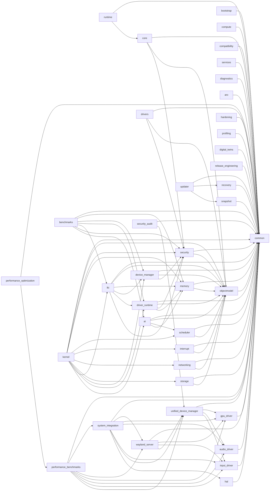

# Architecture: crate dependency graph

This diagram is generated from the actual `path = "../..."` dependencies
declared in each crate's `Cargo.toml` (checked by hand across all 40
crates during the 2026-09 documentation pass, not inferred from naming).
It reflects real Cargo-level coupling, not aspirational layering — several
crates that look like they should depend on each other (e.g.
`security_audit` on `security`) don't, in the current code.

For what each crate actually implements (real vs. simulated), see
[README.md](../../README.md)'s "What's real vs. simulated" table.
For the org-wide picture (how this repo relates to `SHER-Graphics`,
`SHER-Display`, `SHER-Input`, `Aurora`), see README's "Cross-repo boundary"
and "Cross-repo compatibility" sections — this doc is intentionally scoped
to *this* repo's internal graph only.

## Reading this graph

- **Foundation tier** (`common`, `objectmodel`, `security`): depended on
  by nearly everything; no cycles back into higher tiers.
- **`kernel`** is the orchestrator — it has the widest fan-in from the
  "core subsystem" tier (memory/scheduler/interrupt/networking/storage/
  device_manager/driver_runtime/lki/ai) but does **not** depend on the
  driver-shaped subsystems (`hal`, `gpu_driver`, `audio_driver`,
  `input_driver`, `wayland_server`, `unified_device_manager`) — those are
  consumed by sibling repos (`SHER-Graphics`, `SHER-Display`) directly,
  not wired into `SherKernel` itself. `system_integration` is the one
  crate that *does* wire the driver-shaped subsystems together, and it is
  explicitly marked as a deprecated, internal-only Phase-12 test harness
  in its own doc comment — see README's "Cross-repo boundary" section for
  why that's a disclosed exception, not evidence `kernel` secretly depends
  on the driver-shaped tier.
- **`drivers`** is an early, self-contained prototype (discovery →
  matching → sandboxed-load policy) superseded by `device_manager` +
  `driver_runtime` in the real `kernel` wiring; it's kept for its own test
  coverage, not double-wired in.
- Crates with no incoming or outgoing internal edges above
  (`bootstrap`, `compute`, `hal`, `compatibility`, `services`,
  `diagnostics`, `aro`, `hardening`, `profiling`, `digital_twins`,
  `release_engineering`, `runtime`) either only depend on `common`/`core`
  or aren't yet consumed by another in-workspace crate — that's a fan-out
  observation, not a sign they're dead code (several are consumed by
  sibling repos; see README's "Cross-repo boundary").

## Regenerating this diagram

This was built by hand from `grep -A20 '^\[dependencies\]' crates/*/Cargo.toml`
across all 40 crates. If crate dependencies change materially, re-run that
against each `crates/*/Cargo.toml` and update the Mermaid block above —
there is no automated generator for it yet.
